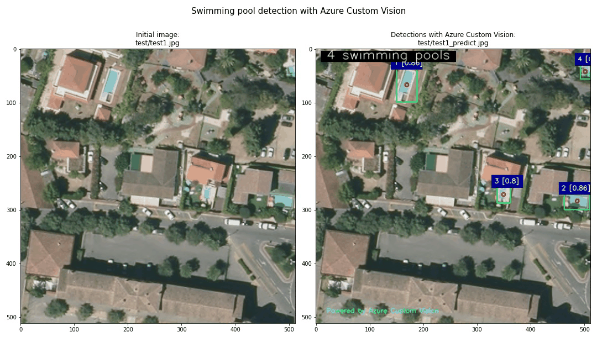

# Swimming pool detection with Azure Custom Vision

This is an Azure Custom Vision demo to detect swimming pool from aerial images.

Labelled images: https://www.kaggle.com/alexj21/swimming-pool-512x512/metadata 
Thanks Alex for sharing this! 

1. We can directly import an existing labelled dataset of images from the kaggle website into an Azure Custom Vision project using PyLabel (no need to do the labelling task in Azure Custom Vision). 
2. Then we will train an object detection model using the nocode interface of Azure Custom Vision. 
3. We can use some python code to call the Azure Custom vision deployed model to display the results. 

Azure Custom Vision: www.customvision.ai 
Documentation: https://docs.microsoft.com/en-us/azure/cognitive-services/custom-vision-service/
 

17-Feb-2022

Serge Retkowsky | serge.retkowsky@microsoft.com | https://www.linkedin.com/in/serger/
